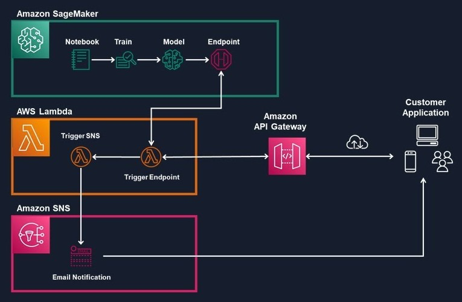
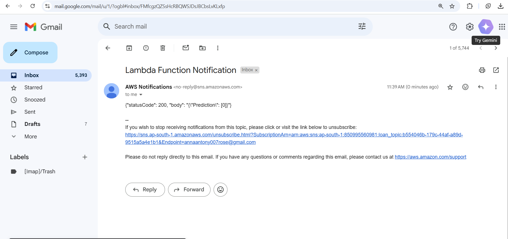

# Loan Eligibility Prediction Using AWS SageMaker & API Automation

 # Project Overview  
This project builds loan eligibility prediction system using Amazon SageMaker for model training. It automates real-time predictions via AWS API Gateway & Lambda and delivers results through Amazon SNS email notifications, ensuring seamless loan application processing.

 Technologies Used  
•	Amazon SageMaker → Model Training & Deployment  
•	Amazon S3→ Dataset Storage  
•	AWS Lambda → Backend Processing  
•	AWS API Gateway → REST API for Predictions  
•	Amazon SNS → Email Notifications  

 # Workflow 
 
	Upload Data → Store the loan application dataset in an Amazon S3 bucket.

	Train Model → Define a SageMaker training job using the RandomForestClassifier algorithm, configuring the appropriate instance type and hyperparameters.

	Save Model → Once training is complete, the trained model is stored in Amazon S3.

	Deploy Model → Create a SageMaker Endpoint to enable real-time loan eligibility predictions using the SageMaker Python SDK.

	API Gateway & Lambda

•	AWS API Gateway receives loan application details as input.

•	The request triggers an AWS Lambda function.

•	Lambda sends the input data to the SageMaker model and retrieves the loan eligibility prediction (approved/rejected).

	Email Notifications

•	The Lambda function publishes prediction results to an Amazon SNS topic.

•	SNS automatically sends an email notification to subscribed users with the loan approval status.

# Conclusion

Project demonstrates the power of machine learning and cloud automation using Amazon SageMaker to train and deploy a predictive model. It seamlessly integrates with AWS API Gateway, Lambda, and SNS to provide real-time predictions and automated notifications.
